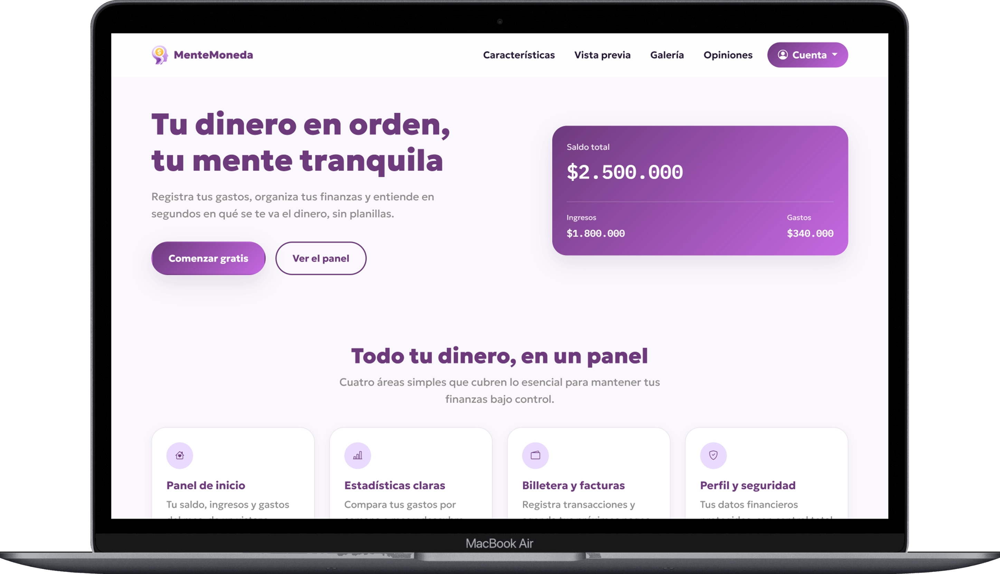
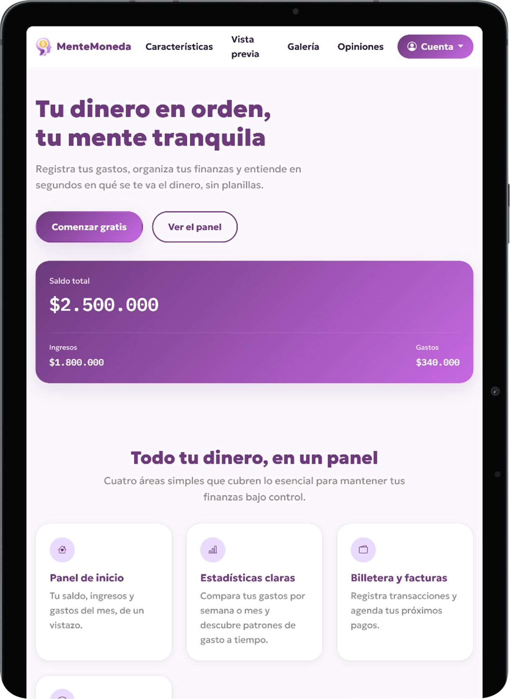

# MenteMoneda — SmartBudget

Landing page de **MenteMoneda**, una app de finanzas personales ficticia,
desarrollada para la evaluación del Módulo 3 (*Desarrollo de la Interfaz
de Usuario Web*) del curso de Frontend de Alkemy. Construida con HTML5
semántico, SASS bajo arquitectura 7-1 y Bootstrap 4.

## Capturas

| Escritorio | Tablet | Móvil |
|---|---|---|
|  |  |  |

## Demo

- **Prototipo de diseño (Figma):** https://www.figma.com/proto/55G2URWVL3zdIhVdNn97pz/MenteMoneda-%E2%80%93-Smart-budget?node-id=1-13&t=BtoDdWwkWz1uV9DS-1&scaling=contain&content-scaling=fixed&page-id=0%3A1&starting-point-node-id=3093%3A4
- **Repositorio:** https://github.com/niino777/SmartBudget.git

- **Sitio en vivo:** 


## Tecnologías

| | |
|---|---|
| Estructura | HTML5 semántico |
| Estilos | SASS (Dart Sass), arquitectura 7-1, metodología BEM |
| Framework CSS | Bootstrap 4.6 (navbar, modales, dropdown, carrusel) |
| Interactividad | JavaScript (ES6, vanilla) |
| Tipografía | Geologica · IBM Plex Mono |
| Diseño | Figma |

## Estructura del proyecto

```
smartbudget/
├── index.html
├── css/style.css                   # CSS compilado desde /sass
├── js/main.js                      # navbar, formularios, simulador de gastos
├── img/
│   └── pantallas/                  # capturas de la app usadas en la galería del sitio
├── sass/                           # arquitectura 7-1
│   ├── abstracts/                  # variables, mixin de media queries, placeholders (@extend)
│   ├── base/                       # reset, tipografía, utilidades
│   ├── components/                 # botón, tarjeta, avatar, fila, navbar, forms, modal
│   ├── layout/                     # hero, features, preview, gallery, testimonials, cta, footer
│   ├── pages/                      # reglas específicas de esta landing
│   ├── themes/                     # detalle de marca
│   ├── vendors/                    # overrides puntuales sobre Bootstrap
│   └── main.scss                   # punto de entrada (@use de todo lo anterior)
├── components/README.md            # catálogo de componentes BEM reutilizados
├── JUSTIFICACION-METODOLOGICA.md    # justificación metodológica completa

```

## Decisiones técnicas

- **BEM** en todas las clases propias (prefijo `mm-`), con un set reducido
  de bloques reutilizados en varias secciones: `.mm-card`, `.mm-btn`,
  `.mm-avatar` y `.mm-row`, cada uno apoyado en su componente nativo de
  Bootstrap 4 (`.card`, `.btn`, `.form-control`).
- **SASS 7-1** ensamblado con `@use` (no `@import`). Los media queries se
  centralizan en un mixin (`respond($breakpoint)`), y los patrones de
  layout repetidos usan placeholders con `@extend` (`%row`, `%col`,
  `%circle`), que agrupan selectores bajo una sola regla en el CSS
  compilado en vez de duplicar propiedades.
- **Modelo de cajas, Flexbox y Grid**: `box-sizing: border-box` global,
  Grid para las grillas de dos dimensiones y Flexbox para el resto.
- **Bootstrap 4**: navbar colapsable, modales, menú desplegable y
  carrusel, con estilos propios sobre los componentes base.